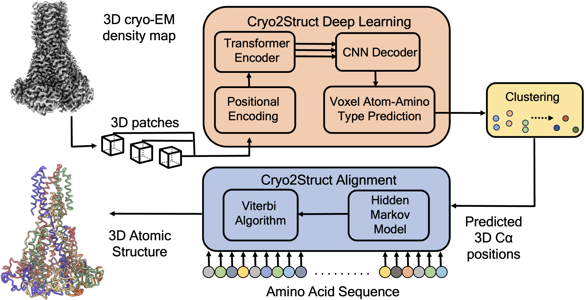

# Cryo2Struct: De Novo Atomic Protein Structure Modeling for Cryo-EM Density Maps Using 3D Transformer and Hidden Markov Model


Cryo2Struct is a method that employs deep learning and statistical modeling for de novo atomic structure modeling of cryogenic electron microscopy (cryo-EM) density maps. The modeling process is entirely automated, requiring no human intervention and is independent of external tools or additional factors. An overview of Cryo2Struct is presented in Figure below, more detail is available in the paper.



## Setup Environment
We will set up the environment using Anaconda.

This is an example of setting up a conda environment to run the code. Use the following command to create the conda environment using the ``cryo2struct.yml`` file.

```
conda env create -f cryo2struct.yml
conda activate cryo2struct
```

## Atomic structure modeling using Cryo2Struct

1. <ins>**Input**</ins>: **cryo-EM density map and sequence** : First, you need to prepare your own data or use our provided example data. The directory should be organized as follows:
```text 
cryo2struct
|── input
    │── 34610
        │-- emd_34610.map
        |-- 8hb0.fasta
```
The `emd_34610.map` is the density map with EMD ID: 34610 downloaded from EMDB website. The `8hb0.fasta` is the corresponding sequence file. 

The first step is to make input cryo-EM map ready for Cryo2Struct. We run [UCSF ChimeraX](https://www.cgl.ucsf.edu/chimerax/index.html) in non-GUI mode to resample the density map to 1 Angstrom, please install it to preprocess the map. We used ChimeraX 1.4-1 in CentOS 8 system. Once ChimeraX is installed, then please run the following.

```
bash preprocess/run_data_preparation.bash input/
```
In the above example ``input/`` is the ``absolute input path`` where the maps are present.

Note: For this example, the normalized map is provided, so there is no need to run the above bash command to prepare the map. Hence, the directory structure for this example looks like this:

```text 
cryo2struct
|── input
    │── 34610
        │-- emd_34610.map
        |-- emd_normalized_map.mrc
        |-- 8hb0.fasta
```

2. **Running Cryo2Struct**
The deep learning requires trained atom and amino acid type models. Please download the trained models from [Cryo2Struct Havard Dataverse](https://doi.org/10.7910/DVN/GQCTTD). The downloaded models should be organized as below:

```text 
cryo2struct
|── input
    │── 34610
        │-- emd_34610.map
        |-- emd_normalized_map.mrc
        |-- 8hb0.fasta
|── models
    │-- amino_acid_type.ckpt
    |-- atom_type.ckpt
```

Update the configurations in the [config/arguments.yml](config/arguments.yml) file. Especialy the input data directory, trained model checkpoint path,  and density map name. Running the inference program on the ``GPU`` speeds up prediction. To enable ``GPU`` processing, modify ``infer_run_on`` in the configuration file to ``gpu`` and provide the GPU device id on ``infer_on_gpu``. 

Cryo2Struct was trained on Cryo2StructData, available at [Cryo2StructData Havard Dataverse](https://doi.org/10.7910/DVN/FCDG0W). The source code for data preprocessing, label generation and validation of training data is available at [Cryo2StructData GitHub repository](https://github.com/BioinfoMachineLearning/cryo2struct). 

**Compile Modified Viterbi algorithm:**
The Hidden Markov Model-guided carbon-alpha alignment programs are available in [viterbi/](viterbi/). The alignment algorithm is written in C++ program, so compile them using: 

```
g++ -fPIC -shared -o viterbi.so viterbi.cpp -O3
```
If the compilation of the program fails due to library issues (which typically occurs when attempting to compile on older systems), you can try compiling using the following approach:
```
conda activate cryo2struct
conda install -c conda-forge gxx
g++ -fPIC -shared -o viterbi.so viterbi.cpp -O3
```
The above command activates the Conda environment and installs the ``gxx`` package, which provides the GCC C++ compiler. This compiler is useful for compiling C++ code on the system. The HMM alignment program runs on the ``CPU`` and is optimized at the highest level using the``-O3`` flag.

Finally, run the following:

```
python3 cryo2struct.py --density_map_name 34610
```

4. <ins>**Output**</ins>:  **Modeled atomic structure**
The output model is saved in the density map's directory. The modeled atomic structure for this example is saved as [input/34610/34610_cryo2struct_full.pdb](input/34610/34610_cryo2struct_full.pdb).


## Contact Information
If you have any question, feel free to open an issue or reach out to us: [ngzvh@missouri.edu](ngzvh@missouri.edu), [chengji@missouri.edu](chengji@missouri.edu).

## Acknowledgements
We thank computing resource Summit supercomputer at the [Oak Ridge Leadership Computing Facility](https://www.olcf.ornl.gov/) for supporting training of the deep transformer model. Additionally, we appreciate the High-Performance Computing (HPC) resource, Hellbender, located at the University of Missouri, Columbia, MO, which was used for both the inference and alignment process.


## Visualizing the Atomic Structure Modeled by Cryo2Struct
The superimposition of the predicted backbone structure (in blue) with the known backbone structure (in gold) of EMD ID: 34610. The density map has a resolution of 2.9 Angstroms and was released on 2023-11-01.


